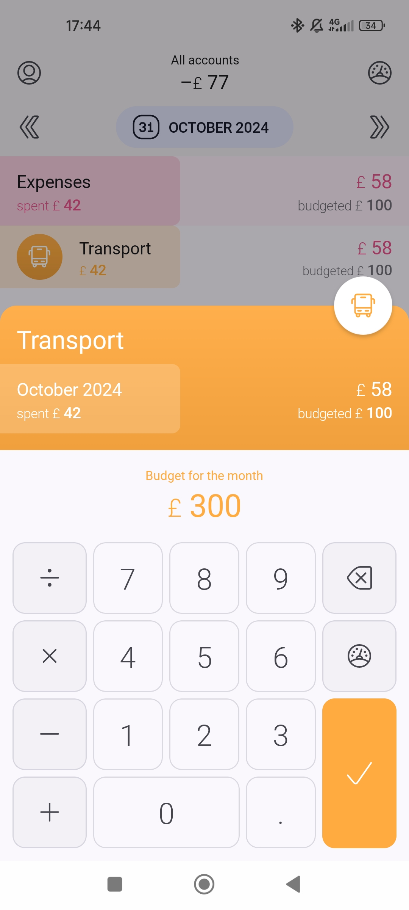
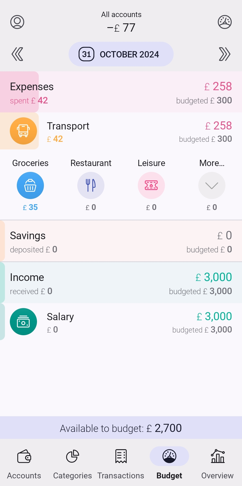
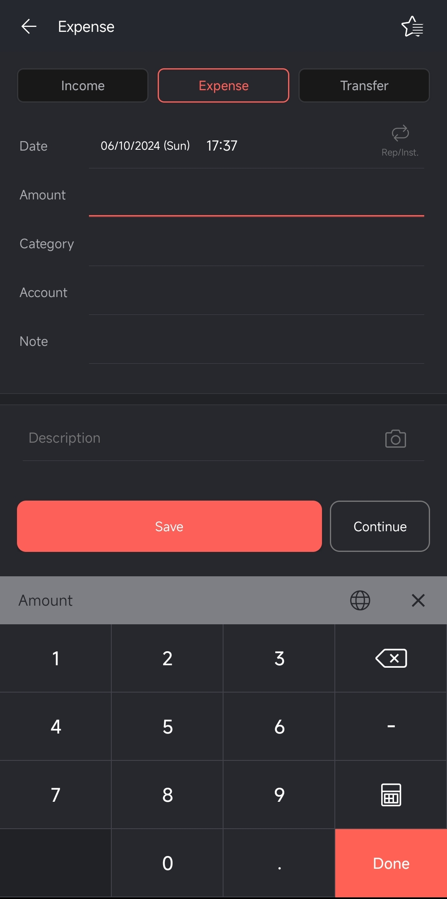
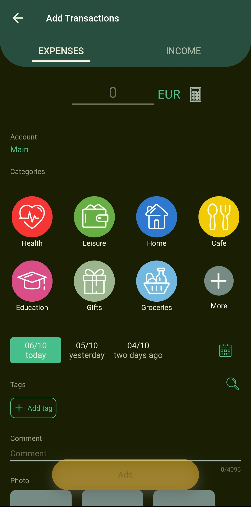

# Unspent

## The idea
I want to build a mobile app that allows users to save money by setting monthly spending budgets and manually entering daily expenses in a quick and intuitive way. The app must be fast, cool, with a modern design suitable for young people.
In a second phase, I will also develop a web application that allows users to analyze in detail the expenses entered and the various monthly budgets in a more practical way for those who want a more in-depth analysis of their expenses.

## Competitors
In the market there are many expense trackers and budgeting apps, but they all have their flaws.
Despite trying many of them in the past, I couldn't stick with any. There are multiple reasons:
- They are too complex
- It's not immediately clear how much remains in the budget
- They require too many steps to enter an expense
- They are slow
- They don't provide financial education; you simply see that you're in the red at the end of the month without understanding why
- They don't have a decent dashboard for expense analysis
- They don't have nice and modern interfaces
- No onboarding or explanation whatsoever
- They all have, at least the ones I've tried, monthly budgets. The problem is that I've noticed I tend to spend more at the beginning of the month and inevitably have to tighten my belt towards the end of the month to stay within budget

    
    
    
    

<small>These are screenshots of some competitors' apps. The UI is too cluttered and unclear.</small>

## App main features
- Onboarding that helps the user set spending budgets based on their net salary
- Expense categories (limited to avoid confusion and help the user budget correctly)
- Ability to enter expenses quickly, without unnecessary touches
- Budget available at a glance on the home page
- Management of recurring expenses
- Reminder notifications for entering expenses and tips for saving money
- Weekly budget tracking instead of monthly

## Onboarding Flow - Preliminary Concept

**Note:** This onboarding flow is a preliminary idea and is subject to change. Elements may be modified, added, or removed based on user testing and A/B test results.

### 1. Welcome Screen
- App logo, tagline, and start button
- Option to skip onboarding for experienced users

### 2. Core Value Proposition
- Highlight 3 key benefits:
    1. Weekly budgeting
    2. Quick expense manual entry
    3. At-a-glance budget view

### 3. Salary Input
- Single input field for monthly net salary
- Option to use a slider for those uncomfortable with exact numbers
- Brief explanation of why this is needed

### 4. Budget Allocation
- Pre-filled pie chart with common expense categories
- Allow quick adjustments with a slider for each category
- "Advanced" button for users who want more detailed control

### 5. Weekly Distribution
- Show monthly budget divided into four weeks
- Option to adjust weekly amounts if desired
- Explain the benefit of weekly budgeting in one sentence

### 6. Quick Add Tutorial
- Animated demonstration of adding an expense
- Interactive element allowing users to try it themselves

### 7. Home Screen
- Brief overlay highlighting key areas:
    - Budget view
    - Quick add button
    - Menu
- "Get Started" button to enter the main app. It could also be a Sign-Up button (TBD).

## Pages and Their Purposes

### 1. Home
- Main dashboard for the app
- Displays current weekly budgets status at a glance
- Shows recent transactions
- Quick access to add new expenses

### 2. Expenses
- List view of all expenses
- Filterable by date range, category, and amount
- Option to edit or delete existing expenses
- Detailed view of individual expenses when tapped

### 3. Add Expense
- Quick and intuitive interface for adding new expenses
- Numpad already visible
- Amount input, category selection (defaulting to a category) and date selection (defaulting to current date) in the same view
- Optional expense name field

### 4. Budgets
- Overview of budget allocation across categories
- Visual representation (e.g. pie chart) of budget distribution
- Option to adjust budget allocations
- Progress bars showing spending in each category

### 5. Insights
- Graphical representations of spending patterns
- Week-over-week and month-over-month comparisons
- This week vs last week and this month vs last month comparisons
- Highlights of top spending categories
- Savings recommendations based on spending habits

### 6. Profile/Settings
- User account information (e.g. delete account, etc)
- App preferences (e.g., currency, notification settings)
- Recurring expenses management
- Export data option
- Help and support resources

## Menu Bar

The menu bar will provide quick access to the most frequently used pages:

1. **Home icon**: Links to the Home page
2. **Currency icon**: Links to the Expenses page
3. **Large '+' icon**: Opens the Add Expense page
4. **List icon**: Links to the Budgets page
5. **Chart icon**: Links to the Insights page

Note: The profile page will be accessible from the home page to keep the main navigation simple and focused on daily use cases.
